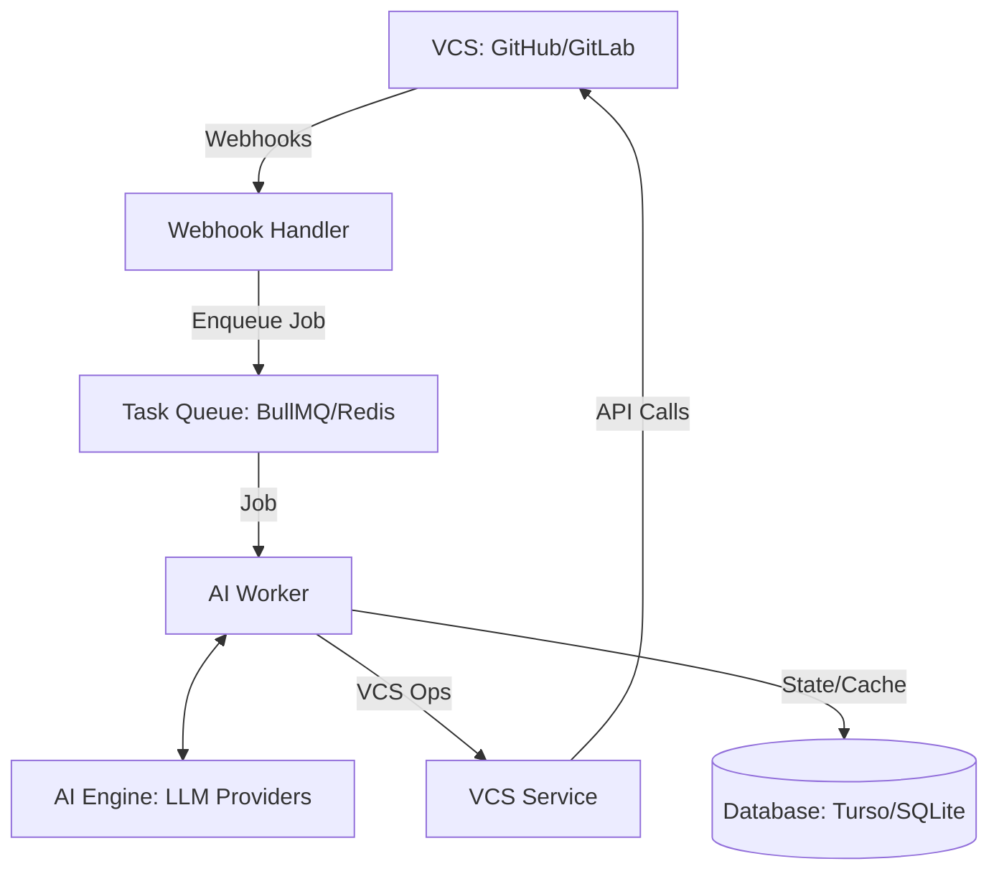

# DevFlow AI Core Architecture

## 1. System Overview
DevFlow AI is a server-side application that integrates with Version Control Systems (VCS) like GitHub and GitLab. It listens for webhook events, processes code changes using LLM APIs, and interacts back with the VCS (e.g., posting comments, creating PRs).

## 2. Component Diagram

## 3. Core Modules

### A. Webhook Handler
- Endpoint to receive VCS events (e.g., `POST /webhooks/github`).
- Validates webhook signatures for security.
- Extracts relevant data: repository, PR number, diff URL, sender.
- Enqueues a processing job based on the event type (e.g., `pr_created`, `pr_synchronized`).

### B. AI Worker
- Background job processor.
- Fetches full code context if needed (PR diffs, surrounding files).
- Orchestrates the flow: Prompting AI -> Processing Response -> Executing VCS Action.
- Handles retries, failures, and rate limits.

### C. AI Engine (LLM Interface)
- Abstraction layer for LLM providers (Gemini, OpenAI, Anthropic).
- Manages prompts for different features:
    - **Summarization**: Generates high-level summaries of changes.
    - **Bug Detection**: Analyzes diffs for common patterns and logical errors.
    - **Test Generation**: Identifies new logic and suggests unit tests.
    - **Doc Sync**: Checks if README or /docs need updates based on code changes.

### D. VCS Service
- Handles all communication with GitHub/GitLab.
- Capabilities:
    - Fetching PR metadata and diffs.
    - Posting PR comments and reviews.
    - Creating commits or PRs (e.g., for automated fixes or doc updates).

### E. Database
- Persistence layer for:
    - Repository configurations.
    - User preferences and tokens.
    - History of AI suggestions (to avoid duplicates or learn from feedback).

## 4. Feature Workflows

### PR Summarization
1. Developer pushes code to a PR.
2. Webhook received -> `summarize_pr` job enqueued.
3. AI Worker fetches PR diff.
4. AI Engine generates summary using a specialized prompt.
5. VCS Service posts the summary as a top-level comment on the PR.

### Bug Detection & Code Review
1. PR event triggers `review_pr` job.
2. AI Worker fetches diff and relevant source files for context.
3. AI Engine analyzes for bugs and style issues.
4. VCS Service creates a PR review with inline comments on specific lines.

## 5. Technology Stack
- **Backend**: Node.js, TypeScript, Express.
- **Queue**: BullMQ with Redis.
- **Database**: SQLite (synced via Turso).
- **VCS API**: Octokit (GitHub), GitLab API SDK.
- **AI**: Gemini Pro API.

## 6. Security Considerations
- Webhook secret verification.
- OAuth2 for VCS access with minimum required scopes.
- Sanitization of user-provided code before sending to LLM (PII/Secret detection).
